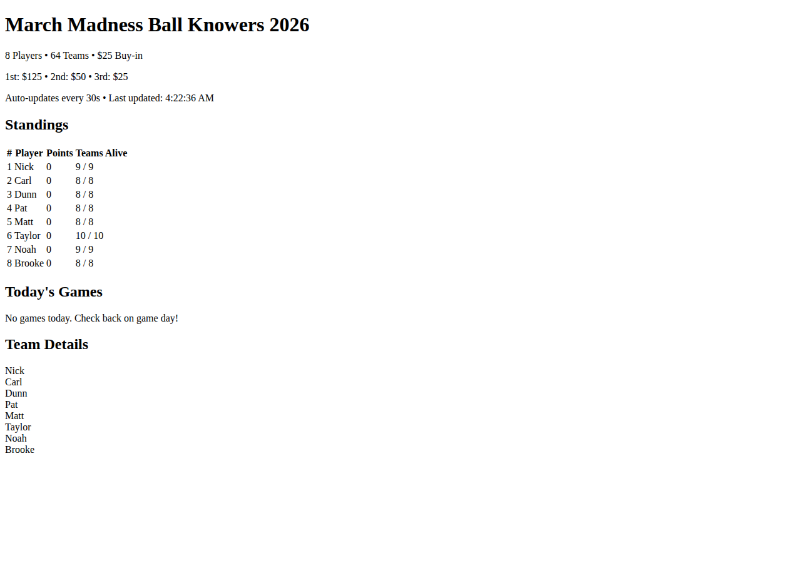

# March Madness Ball Knowers 2026

A real-time scoreboard for tracking a March Madness fantasy basketball pool. Eight players draft NCAA tournament teams and earn points based on their teams' win margins throughout the tournament.

## How It Works

- **8 players** each draft 8-10 NCAA tournament teams
- When a drafted team wins, the player earns points equal to the **margin of victory**
- First Four (play-in) games are excluded from scoring
- Standings update automatically every 30 seconds using live ESPN data

## Features

- **Live Scoreboard** - Today's games with real-time scores and a pulsing indicator for active games
- **Standings Table** - Player rankings by total points with teams-alive counts
- **Team Details** - Per-player breakdowns showing each team's game history, status, and points earned

## Prize Pool

| Place | Prize |
|-------|-------|
| 1st   | $125  |
| 2nd   | $50   |
| 3rd   | $25   |

Buy-in: $25

## Setup

No build step required. Open `index.html` in a browser.

## Tech Stack

- Vanilla HTML/JS (single file)
- Tailwind CSS (CDN)
- ESPN Scoreboard API
